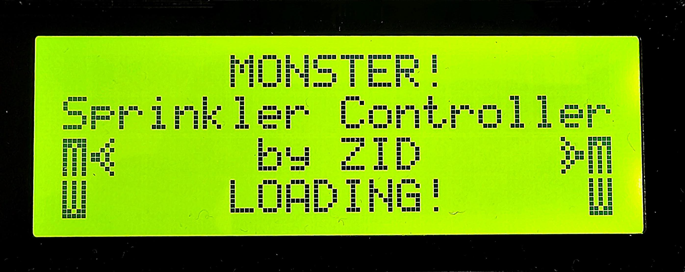
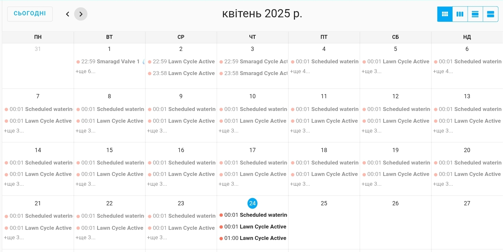

**Tags:** `Home Assistant`, `ESPHome`, `Sprinkler Controller`, `Irrigation`
# Monster sprinkler controller
<div align="center">
  
</div>


# Sprinkler Controller "Monster"  
**by ZID**

## Monster: Your Autonomous Smart Irrigation Assistant  
*Monster* is a smart **ESP32-based** device designed to manage irrigation with maximum autonomy and ease. It’s perfect for those who want their garden, lawn, or shrubs to stay well-maintained without constant attention, even without internet access. Featuring local control via buttons and an LCD display, built-in real-time clock, and additional options through a web server and Home Assistant integration, *Monster* blends reliability with modern technology.

Imagine you have a countryside home with a small garden, a neat lawn, shrubs along the fence, and decorative **"Golden Smaragd"** thuja trees by the entrance. You love keeping everything pristine but don’t want to spend time watering daily or worry about plants drying out while you’re away. That’s where *Monster* steps in — your autonomous helper.

### How It Works  

#### On-Site Setup  
You install *Monster* near your irrigation system and connect the valves for four zones: **"Golden Smaragd"** (2 valves for the thuja), **"Lawn"** (3 valves for the lawn), **"Garden"** (1 valve for the garden), and **"Bushes"** (2 valves for the shrubs). No internet is needed — all control is local.  
Using the **"Button UP"**, **"Button DOWN"**, and **"Menu Button"**, you access the LCD menu. First, set the time via **"Time setting"**: select the current year (**"Year set"**), month (**"Month set"**), day (**"Day set"**), hours (**"Hour set"**), and minutes (**"Minutes set"**), then save with **"Set Manual Time"**. The clock now runs independently, no network required.

#### Creating Schedules  
Suppose the thuja need watering three times a week, the lawn twice, the garden once, and the shrubs every other day. You enter **"Smaragd Schedule"** and configure:  
- **"Schedule 1"** — watering at `07:00` on Mondays, Wednesdays, and Fridays (**"Smaragd Monday"**, **"Smaragd Wednesday"**, **"Smaragd Friday"**), 15 minutes (**"1 Duration"**).  
- For the lawn in **"Lawn Schedule"**, set **"Schedule 1"** — `06:30` on Tuesdays and Saturdays (**"Lawn Tuesday"**, **"Lawn Saturday"**), 20 minutes (**"2 Duration"**).  
- The garden (**"Garden Schedule"**) waters on Thursdays at `08:00` (**"Garden Thursday"**), 10 minutes (**"Duration"**).  
- Shrubs (**"Bushes Schedule"**) — every other day at `19:00`, 12 minutes (**"1 Duration"**).  
Each step is confirmed with a sound (if **"Sound ON/OFF"** is enabled), and the display backlight (**"Auto Bright"**) activates for easy evening use.

#### Autonomous Operation  
You head to the city for a week. *Monster* follows the schedule: Monday morning waters the thuja, Tuesday the lawn, Thursday the garden, and so on. If it rains, you’ve pre-activated **"24h Rain Delay"** with a long button press — irrigation pauses for a day. The RGB LED glows **blue** on startup, then **red**, indicating Wi-Fi is off (you don’t need it).

#### Web Server Check  
Back home, you connect *Monster* to Wi-Fi via **"WiFi ON/OFF"**. On your phone, you open the web interface using **"IP Address"** and see: **"Smaragd Days Status"** lists completed days, **"Sprinkler Remaining Time Lawn"** shows the lawn watering (5 minutes left), and **"RAM Usage"** and **"Uptime"** confirm stable performance. You can even manually trigger **"Garden Active"** to refresh the garden after a hot day.

#### Home Assistant Control  
For added comfort, you link *Monster* to *Home Assistant*. Your smartphone now shows: **"Smaragd Schedule 1 Time"** (`07:00–07:15`), **"Lawn Valve 2 Status"** (on), **"Sprinkler Remaining Time Bushes"** (⏳ `0:08`). You can turn off shrub watering if the soil’s already damp, all from your couch.

### Why You Need It  
- **Time-Saving**: *Monster* handles irrigation while you relax or work.  
- **Flexibility**: Tailor schedules to your plants — from rare garden watering to frequent lawn care.  
- **Reliability**: It runs on your settings even without internet or power (with a backup).  
- **Convenience**: Choose local menus, web server, or *Home Assistant* for control.

---

## Core Features  

1. **Fully Autonomous Irrigation Control**  
*Monster* manages four zones — **"Golden Smaragd"**, **"Lawn"**, **"Garden"**, and **"Bushes"** — without needing a network. Set up to three schedules per zone:  
   - *Start Time*: Pick hours and minutes.  
   - *Days of the Week*: Choose days (e.g., **"Smaragd Monday"** or **"Lawn Sunday"**).  
   - *Duration*: Set valve run times (e.g., **"Smaragd 1 Run Duration"**, **"Garden Duration"**).  
   - *Repeats*: Define cycles (**"Smaragd Repeat Count"**, **"Lawn Repeat Count"**).  
It auto-starts irrigation, switches valves (e.g., **"Smaragd 1 Active"**, **"Lawn 2 Active"**), and supports sequential zoning (**"Smaragd Auto Advance"**), running flawlessly without Wi-Fi or servers.

2. **Local Display and Button Interface**  
Control is at your fingertips:  
   - **"Menu Button"**: Opens an intuitive LCD menu.  
   - **"Button UP"** and **"Button DOWN"**: Navigate settings or pages.  
   - Browse zones (**"Smaragd Schedule"**, **"Lawn Schedule"**), time (**"Time setting"**), or brightness (**"Brightness"**).  
The display shows the active zone, valve status (**"Smaragd Valve 1 Status"**), remaining time (**"Sprinkler Remaining Time Garden"**), and alerts like **"WiFi on!"** or **"Rain Delay"**.

3. **Internet-Free Real-Time Clock**  
*Monster*’s built-in clock runs independently. Set it manually in **"Time setting"**:  
   - **"Year set"** (year),  
   - **"Month set"** (month),  
   - **"Day set"** (day),  
   - **"Hour set"** (hours),  
   - **"Minutes set"** (minutes).  
Hit **"Set Manual Time"** to save, ensuring schedules work without external sync.

4. **Rain Delay Protection**  
Prevent overwatering with **"24h Rain Delay"** or **"48h Rain Delay"**. Activate via menu or long button press, pausing irrigation for 24 or 48 hours before resuming automatically.

5. **Audible Feedback**  
Actions come with sound (if **"Sound ON/OFF"** is on), making interaction lively and clear — think page switches or menu selections.

6. **RGB Status Indication**  
The RGB LED pulses to show status:  
   - **Blue**: Device booting.  
   - **Green**: Wi-Fi connected (**"WiFi is connected!"**).  
   - **Red**: Wi-Fi off or error.  
   - *Other hues*: Home Assistant link or valve activity.

7. **Display Backlight Control**  
Adjust **"Brightness"** manually (`0%–100%`) or enable **"Auto Bright"** for 10-second illumination on button press, saving power and enhancing usability anytime.

---

## Menu Functions  
*Monster*’s menu, accessed via **"Menu Button"**, is the core of local control, organized into handy groups:  

### Rain Delay Control  
- **"24h Rain Delay"**: Toggle a 24-hour irrigation pause for rainy days.  
- **"48h Rain Delay"**: Set a 48-hour delay.
- **"ALL OFF"**: if active then schedules are not executed.

**I have plans for a rain sensor, but I haven't figured out how to implement it reliably yet. I am not entirely satisfied with what is on the Internet.**


### Irrigation Schedule Setup  
- **"Smaragd Schedule"** (*"Golden Smaragd"*):  
  - **"Schedule 1"**, **"Schedule 2"**, **"Schedule 3"**: Enable/disable and set times (**"Smaragd Schedule 1 Time"**).  
  - **"Select days"**: Pick days (**"Smaragd Monday"** to **"Smaragd Sunday"**).  
  - **"1 Duration"**, **"2 Duration"**: Set valve run times.  
  - **"Repeat Count"**: Number of cycles.  
  - **"Zone 1 Auto"**, **"Zone 2 Auto"**: Auto valve mode.  
  - **"Smaragd AA"**: Sequential valve switching.  
  - **"Smaragd Cycl"**: Full cycle activation.  

- **"Lawn Schedule"** (*"Lawn"*):  
  - **"Schedule 1"**, **"Schedule 2"**, **"Schedule 3"**: Times (**"Lawn Schedule 1 Time"**).  
  - **"Select days"**: Days (**"Lawn Monday"** to **"Lawn Sunday"**).  
  - **"1 Duration"**, **"2 Duration"**, **"3 Duration"**: Valve durations.  
  - **"Repeat Count"**: Cycles.  
  - **"Zone 1 Auto"**, **"Zone 2 Auto"**, **"Zone 3 Auto"**: Auto mode.  
  - **"Lawn AA"**: Sequential switching.  
  - **"Lawn Cycl"**: Full cycle.  

- **"Garden Schedule"** (*"Garden"*):  
  - **"Schedule 1"**, **"Schedule 2"**, **"Schedule 3"**: Times (**"Garden Schedule 1 Time"**).  
  - **"Select days"**: Days (**"Garden Monday"** to **"Garden Sunday"**).  
  - **"Duration"**: Valve run time.  

- **"Bushes Schedule"** (*"Bushes"*):  
  - **"Schedule 1"**, **"Schedule 2"**, **"Schedule 3"**: Times (**"Bushes Schedule 1 Time"**).  
  - **"Select days"**: Days (**"Bushes Monday"** to **"Bushes Sunday"**).  
  - **"1 Duration"**, **"2 Duration"**: Valve durations.  
  - **"Repeat Count"**: Cycles.  
  - **"Zone 1 Auto"**, **"Zone 2 Auto"**: Auto mode.  
  - **"Bushes AA"**: Sequential switching.  
  - **"Bushes Cycl"**: Full cycle.  

### Display and Device Settings  
- **"Display Settings"**:  
  - **"Time setting"**: Submenu for time setup:  
    - **"Year set"**: Year.  
    - **"Month set"**: Month.  
    - **"Day set"**: Day.  
    - **"Hour set"**: Hours.  
    - **"Minutes set"**: Minutes.  
    - **"Set Time"**: Save time.  
  - **"Brightness"**: Adjust display brightness (`0–100%`).  
  - **"Auto Bright"**: Auto-backlight on button press.  
  - **"Sound"**: Toggle sounds on/off.  
  - **"WIFI auto"**: Auto Wi-Fi connection.  
  - **"WiFi ON/OFF"**: Manual Wi-Fi control.  
  - **"IP: [IP Address]"**: Current IP display.  
  - **"SSID: [Connected SSID]"**: Connected network name.  
  - **"WiFi Signal: [WiFi Signal]"**: Signal strength.  
  - **"Restart ESP"**: Reboot device.  
Each setting comes with a beep (if **"Sound"** is on) and backlight for nighttime ease.

---

## Web Server Features  
Connect *Monster* to Wi-Fi (**"WiFi ON/OFF"** or **"WIFI auto"**) for a local web interface:  
- View zone status (**"Smaragd Days Status"**, **"Lawn Schedule 1 Time"**).  
- Manually control valves (**"Smaragd 1 Active"**, **"Garden Active"**).  
- Track remaining time (**"Sprinkler Remaining Time Lawn"**).  
- Check device stats: **"IP Address"**, **"Connected SSID"**, **"WiFi Signal"**, **"RAM Usage"**, **"Flash Usage"**, **"Uptime"**.  
- Reboot via **"Restart"**.  
It’s local and internet-free, preserving autonomy.

---

## Home Assistant Integration  
For enhanced control, *Monster* integrates with *Home Assistant*, offering **"HA info"** data for all zones (**"Golden Smaragd"**, **"Bushes"**, **"Lawn"**, **"Garden"**):  
- **"Smaragd Days Status"**: Days selected (e.g., `"Mon Wed Fri"`).  
- **"Smaragd Schedule 1 Time"**: Start/end of first schedule (e.g., `"08:00 - 08:30"` or `"OFF"`).  
- **"Smaragd Schedule 2 Time"**: Second schedule time.  
- **"Smaragd Schedule 3 Time"**: Third schedule time.  
- **"Sprinkler Remaining Time (Golden Smaragd)"**: Active valve time (`⏳ "0:15"` or `❌ "No time zone running"`).  
- **"Smaragd Valve 1 Status"**: First valve state (on/off).  
- **"Smaragd Valve 2 Status"**: Second valve state.  
This lets you monitor and manage remotely, though local clocks and autonomy remain the priority.


## **You can track and control irrigation using a calendar in Home Assistant**.

1. Create a calendar named **Watering schedule**.
2. Create an automation and paste the provided code into it.

This setup allows you to manage irrigation days directly from the Home Assistant calendar interface.

## Example Automation

```yaml

alias: Watering record calendar
description: ""
triggers:
  - trigger: time
    at: "00:01:00"
    id: Midnight
  - trigger: state
    entity_id:
      - switch.monster_smaragd_cycle_active
    id: Smaragd Cycle off
    for:
      hours: 0
      minutes: 0
      seconds: 2
    from: "on"
    to: "off"
  - trigger: state
    entity_id:
      - switch.monster_smaragd_cycle_active
    id: Smaragd Cycle on
    for:
      hours: 0
      minutes: 0
      seconds: 2
    from: "off"
    to: "on"
  - trigger: state
    entity_id:
      - switch.monster_lawn_cycle_active
    id: Lawn Cycle on
    for:
      hours: 0
      minutes: 0
      seconds: 2
    from: "off"
    to: "on"
    enabled: true
  - trigger: state
    entity_id:
      - switch.monster_lawn_cycle_active
    id: Lawn Cycle off
    for:
      hours: 0
      minutes: 0
      seconds: 2
    from: "on"
    to: "off"
    enabled: true
  - trigger: state
    entity_id:
      - switch.monster_garden_active
    id: Garden Cycle off
    for:
      hours: 0
      minutes: 0
      seconds: 2
    from: "on"
    to: "off"
    enabled: true
  - trigger: state
    entity_id:
      - switch.monster_garden_active
    id: Garden Cycle on
    for:
      hours: 0
      minutes: 0
      seconds: 2
    from: "off"
    to: "on"
    enabled: true
  - trigger: state
    entity_id:
      - switch.monster_bushes_cycle_active
    id: Bushes Cycle on
    for:
      hours: 0
      minutes: 0
      seconds: 2
    from: "off"
    to: "on"
    enabled: true
  - trigger: state
    entity_id:
      - switch.monster_bushes_cycle_active
    id: Bushes Cycle off
    for:
      hours: 0
      minutes: 0
      seconds: 2
    from: "on"
    to: "off"
    enabled: true
conditions: []
actions:
  - alias: General watering for the day
    if:
      - condition: trigger
        id:
          - Полночь
        enabled: true
    then:
      - variables:
          active_schedules: >
             

            
              
             

            
              
             

            
              
             

            
              
               

            
              
               

             
              
             


               
              
               

            
              
               

             
              
             

               
              
               

            
              
               

             
              
             

            {{ schedules }}
        enabled: true
      - if:
          - condition: template
            value_template: "{{ active_schedules | length > 0 }}"
        then:
          - action: calendar.create_event
            target:
              entity_id: calendar.watering_schedule
            data:
              summary: Scheduled watering for today {{ now().strftime('%d.%m.%Y') }}
              start_date_time: "{{ now().replace(hour=0, minute=1, second=0).isoformat() }}"
              end_date_time: "{{ now().replace(hour=0, minute=2, second=0).isoformat() }}"
              description: >-
                Scheduled watering for today {{ now().strftime('%d.%m.%Y') }} 
                  
                    - {{ schedule }}
                  
                
                  No scheduled watering for today.
                
        enabled: true
  - alias: Smaragd Cycle Active
    if:
      - condition: trigger
        id:
          - Smaragd Cycle on
          - Smaragd Cycle off
      - condition: and
        conditions:
          - condition: not
            conditions:
              - condition: state
                entity_id: switch.monster_smaragd_cycle_active
                state: unavailable
    then:
      - action: calendar.create_event
        target:
          entity_id: calendar.watering_schedule
        data:
          summary: >-
            Smaragd Cycle Active 💧🌱 {{ 'Turned ON' if
            states('switch.monster_smaragd_cycle_active') == 'on' else 'Turned
            OFF' }}
          start_date_time: "{{ now() }}"
          end_date_time: "{{ now() + timedelta(minutes=1) }}"
        alias: Smaragd Cycle Active
  - alias: Lawn Cycle Active
    if:
      - condition: trigger
        id:
          - Lawn Cycle on
          - Lawn Cycle off
      - condition: and
        conditions:
          - condition: not
            conditions:
              - condition: state
                entity_id: switch.monster_lawn_cycle_active
                state: unavailable
    then:
      - action: calendar.create_event
        target:
          entity_id: calendar.watering_schedule
        data:
          summary: >-
            Lawn Cycle Active 💧🌲 {{ 'Turned ON' if
            states('switch.monster_lawn_cycle_active') == 'on' else 'Turned OFF'
            }}
          start_date_time: "{{ now() }}"
          end_date_time: "{{ now() + timedelta(minutes=1) }}"
        alias: Lawn Cycle Active
  - alias: Garden Cycle Active
    if:
      - condition: trigger
        id:
          - Garden Cycle off
          - Garden Cycle on
      - condition: and
        conditions:
          - condition: not
            conditions:
              - condition: state
                entity_id: switch.monster_garden_active
                state: unavailable
    then:
      - action: calendar.create_event
        target:
          entity_id: calendar.watering_schedule
        data:
          summary: >-
            Garden Cycle Active 💧🌲 {{ 'Turned ON' if
            states('switch.monster_garden_active') == 'on' else 'Turned OFF' }}
          start_date_time: "{{ now() }}"
          end_date_time: "{{ now() + timedelta(minutes=1) }}"
        alias: Garden Cycle Active
  - alias: Bushes Cycle Active
    if:
      - condition: trigger
        id:
          - Bushes Cycle on
          - Bushes Cycle off
      - condition: and
        conditions:
          - condition: not
            conditions:
              - condition: state
                entity_id: switch.monster_bushes_cycle_active
                state: unavailable
    then:
      - alias: Bushes Cycle Active
        action: calendar.create_event
        target:
          entity_id: calendar.watering_schedule
        data:
          summary: >-
            Bushes Cycle Active 💧🌲 {{ 'Turned ON' if
            states('switch.monster_bushes_cycle_active') == 'on' else 'Turned
            OFF' }}
          start_date_time: "{{ now() }}"
          end_date_time: "{{ now() + timedelta(minutes=1) }}"
mode: single

```


You can extend this with additional cycles as needed.
This approach gives a clear and visual history of watering actions on your calendar.


<div align="center">
  
</div>


---

## Why Monster is Perfect  
*Monster* is built for independence lovers. It runs locally on your settings and clock, with a web server for monitoring and *Home Assistant*’s **"HA info"** for smart home fans. Flexible yet simple, it keeps your lawn to garden thriving effortlessly.  
With *Monster*, your garden flourishes while you relax. **Autonomy**, **style**, and **smart tech** — all in one!

---

## Components

ESP32-S3
<div align="center">
  
</div>

--- 

DS1307
<div align="center">
  
</div>

---

LCD PCF8574
<div align="center">
  
</div>

---

XL9535
<div align="center">
  
</div>

---

Rtttl Buzzer
<div align="center">
  
</div>

---

Button
<div align="center">
  
</div>

---

2 Pin Way Waterproof Electrical Wire Connector Plug
<div align="center">
  
</div>

---

<div align="center">
  <h3><b>Web Server</b></h3>
</div>

---

<div align="center">
  
</div>

---

Learn more from *Home Assistant* community members **[GrahamS](https://community.home-assistant.io/u/grahams/summary)** and **[raythefourth](https://community.home-assistant.io/u/raythefourth/summary)**, who contribute to such integrations.

Check out these *Home Assistant* community discussions by **[lordzid](https://community.home-assistant.io/u/lordzid/summary)**:  
- **[Set DS1307 Time to Specific Value](https://community.home-assistant.io/t/set-ds1307-time-to-specific-value/777711/5?u=lordzid)** — Configuring the DS1307 real-time clock.  
- **[Simple Reliable Sprinkler Controller with ESPHome](https://community.home-assistant.io/t/simple-reliable-sprinkler-controller-with-esphome/628838?u=lordzid)** — Building a dependable sprinkler solution.


**Tags:** `Home Assistant`, `ESPHome`, `Sprinkler Controller`, `Irrigation`
